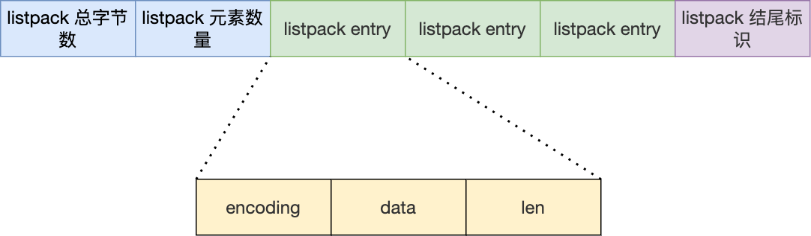

# Redis 数据结构

## SDS

Redis 的 String 数据类型的底层数据结构是 SDS。

C 语言的字符串不足之处以及可以改进的地方：

-   获取字符串长度的时间复杂度为 O（N）；
-   字符串的结尾是以 “\0” 字符标识，字符串里面不能包含有 “\0” 字符，因此不能保存二进制数据；
-   字符串操作函数不高效且不安全，比如有缓冲区溢出的风险，有可能会造成程序运行终止；


## 链表

Redis 的链表实现优点如下：

-   listNode 链表节点的结构里带有 prev 和 next 指针，**获取某个节点的前置节点或后置节点的时间复杂度只需O(1)，而且这两个指针都可以指向 NULL，所以链表是无环链表**；
-   list 结构因为提供了表头指针 head 和表尾节点 tail，所以**获取链表的表头节点和表尾节点的时间复杂度只需O(1)**；
-   list 结构因为提供了链表节点数量 len，所以**获取链表中的节点数量的时间复杂度只需O(1)**；
-   listNode 链表节使用 void* 指针保存节点值，并且可以通过 list 结构的 dup、free、match 函数指针为节点设置该节点类型特定的函数，因此**链表节点可以保存各种不同类型的值**；

链表的缺陷也是有的：

-   链表每个节点之间的内存都是不连续的，意味着**无法很好利用 CPU 缓存**。能很好利用 CPU 缓存的数据结构就是数组，因为数组的内存是连续的，这样就可以充分利用 CPU 缓存来加速访问。
-   还有一点，保存一个链表节点的值都需要一个链表节点结构头的分配，**内存开销较大**。

因此，Redis 3.0 的 List 对象在数据量比较少的情况下，会采用「压缩列表」作为底层数据结构的实现，它的优势是节省内存空间，并且是内存紧凑型的数据结构。

##  压缩列表

压缩列表是 Redis 为了节约内存而开发的，它是**由连续内存块组成的顺序型数据结构**，有点类似于数组。


在压缩列表中，如果我们要查找定位第一个元素和最后一个元素，可以通过表头三个字段（zllen）的长度直接定位，复杂度是 O(1)。而**查找其他元素时，就没有这么高效了，只能逐个查找，此时的复杂度就是 O(N) 了，因此压缩列表不适合保存过多的元素**。

压缩列表节点包含三部分内容：

-   ***prevlen***，记录了「前一个节点」的长度，目的是为了实现从后向前遍历；
-   ***encoding***，记录了当前节点实际数据的「**<u>类型和长度</u>**」，类型主要有两种：字符串和整数。
-   ***data***，记录了当前节点的实际数据，类型和长度都由 `encoding` 决定；

压缩列表新增某个元素或修改某个元素时，如果空间不不够，压缩列表占用的内存空间就需要重新分配。而当新插入的元素较大时，可能会导致**<u>后续元素的 prevlen 占用空间都发生变化</u>**，从而引起「连锁更新」问题，导致每个元素的空间都要重新分配，造成访问压缩列表<u>**性能的下降**</u>。

## 哈希表

**Redis 采用了「链式哈希」来解决哈希冲突**

哈希表实际上是一个数组，数组里多每一个元素就是一个哈希桶。当一个键值对的键经过 Hash 函数计算后得到哈希值，再将(哈希值 % 哈希表大小)取模计算，得到的结果值就是该 key-value 对应的数组元素位置，也就是第几个哈希桶。

链式哈希局限性也很明显，随着链表长度的增加，在查询这一位置上的数据的耗时就会增加，毕竟链表的查询的时间复杂度是 O(n)。

要想解决这一问题，就需要进行 rehash，也就是对哈希表的大小进行扩展。

在实际使用哈希表时，Redis 定义一个 dict 结构体，这个结构体里定义了**两个哈希表（ht[2]）**。

```c
typedef struct dict {
    …
    //两个Hash表，交替使用，用于rehash操作
    dictht ht[2]; 
    …
} dict;
```

之所以定义了 2 个哈希表，是因为进行 rehash 的时候，需要用上 2 个哈希表了。


在正常服务请求阶段，插入的数据，都会写入到「哈希表 1」，此时的「哈希表 2 」 并没有被分配空间。

随着数据逐步增多，触发了 rehash 操作，这个过程分为三步：

-   给「哈希表 2」 分配空间，一般会比「哈希表 1」 大一倍（两倍的意思）；
-   将「哈希表 1 」的数据迁移到「哈希表 2」 中；
-   迁移完成后，「哈希表 1 」的空间会被释放，并把「哈希表 2」 设置为「哈希表 1」，然后在「哈希表 2」 新创建一个空白的哈希表，为下次 rehash 做准备。

这个过程看起来简单，但是其实第二步很有问题，**如果「哈希表 1 」的数据量非常大，那么在迁移至「哈希表 2 」的时候，因为会涉及大量的数据拷贝，此时可能会对 Redis 造成阻塞，无法服务其他请求**。

为了避免 rehash 在数据迁移过程中，因拷贝数据的耗时，影响 Redis 性能的情况，所以 Redis 采用了**渐进式 rehash**，也就是将数据的迁移的工作不再是一次性迁移完成，而是分多次迁移。

渐进式 rehash 步骤如下：

-   给「哈希表 2」 分配空间；
-   **在 rehash 进行期间，每次哈希表元素进行新增、删除、查找或者更新操作时，Redis 除了会执行对应的操作之外，还会顺序将「哈希表 1 」中索引位置上的所有 key-value 迁移到「哈希表 2」 上**；
-   随着处理客户端发起的哈希表操作请求数量越多，最终在某个时间点会把「哈希表 1 」的所有 key-value 迁移到「哈希表 2」，从而完成 rehash 操作。

这样就巧妙地把一次性大量数据迁移工作的开销，分摊到了多次处理请求的过程中，避免了一次性 rehash 的耗时操作。

## 整数集合

整数集合是 Set 对象的底层实现**<u>之一</u>**。当一个 Set 对象只包含整数值元素，并且元素数量不大时，就会使用整数集这个数据结构作为底层实现。

整数集合本质上是一块连续内存空间

## * 跳表

Redis 只有 Zset 对象的底层实现用到了跳表，跳表的优势是能支持平均 O(logN) 复杂度的节点查找。

zset 结构体里有两个数据结构：一个是跳表，一个是哈希表。这样的好处是既能进行高效的范围查询，也能进行高效单点查询。

```c
typedef struct zset {
    dict *dict;
    zskiplist *zsl;
} zset;
```

Zset 对象在执行数据插入或是数据更新的过程中，会依次在跳表和哈希表中插入或更新相应的数据，从而保证了跳表和哈希表中记录的信息一致。

### 跳表节点查询过程

查找一个跳表节点的过程时，跳表会从头节点的最高层开始，逐一遍历每一层。在遍历某一层的跳表节点时，会用跳表节点中的 SDS 类型的元素和元素的权重来进行判断，共有两个判断条件：

-   如果当前节点的权重「小于」要查找的权重时，跳表就会访问该层上的下一个节点。
-   如果当前节点的权重「等于」要查找的权重时，并且当前节点的 SDS 类型数据「小于」要查找的数据时，跳表就会访问该层上的下一个节点。

**跳表的相邻两层的节点数量最理想的比例是 2:1，查找复杂度可以降低到 O(logN)**。

### 为什么 Zset 的实现用跳表而不用平衡树（如 AVL树、红黑树等）？

-   **从内存占用上来比较，跳表比平衡树更灵活一些**。平衡树每个节点包含 2 个指针（分别指向左右子树），而跳表每个节点包含的指针数目平均为 1/(1-p)，具体取决于参数 p 的大小。如果像 Redis里的实现一样，取 p=1/4，那么平均每个节点包含 1.33 个指针，比平衡树更有优势。
-   **在做范围查找的时候，跳表比平衡树操作要简单**。在平衡树上，我们找到指定范围的小值之后，还需要以中序遍历的顺序继续寻找其它不超过大值的节点。如果不对平衡树进行一定的改造，这里的中序遍历并不容易实现。而在跳表上进行范围查找就非常简单，只需要在找到小值之后，对第 1 层链表进行若干步的遍历就可以实现。
-   **从算法实现难度上来比较，跳表比平衡树要简单得多**。平衡树的插入和删除操作可能引发子树的调整，逻辑复杂，而跳表的插入和删除只需要修改相邻节点的指针，操作简单又快速。

## quicklist

它是一种将列表按照一定的长度范围划分成多个小块，每个小块称为一个 ziplist（压缩列表）的数据结构。这样做的好处是可以在保持较小的内存开销的同时，保持列表的高效性能。

## listpack

listpack 采用了压缩列表的很多优秀的设计，比如还是用一块连续的内存空间来紧凑地保存数据，并且为了节省内存的开销，listpack 节点会采用不同的编码方式保存不同大小的数据。



主要包含三个方面内容：

-   encoding，定义该元素的编码类型，会对不同长度的整数和字符串进行编码；
-   data，实际存放的数据；
-   len，encoding+data的总长度；

可以看到，**listpack 没有压缩列表中记录前一个节点长度的字段了，listpack 只记录当前节点的长度，当我们向 listpack 加入一个新元素的时候，不会影响其他节点的长度字段的变化，从而避免了压缩列表的连锁更新问题**。

>   压缩列表的entry为什么要保存prevlen呢？listpack改成len之后不会影响功能吗？

压缩列表的 entry 保存 prevlen 是为了实现节点从后往前遍历，知道前一个节点的长度，就可以计算前一个节点的偏移量。

listpack 一样可以支持从后往前遍历的。详细的算法可以看：https://github.com/antirez/listpack/blob/master/listpack.c 里的lpDecodeBacklen函数，lpDecodeBacklen 函数就可以从当前列表项起始位置的指针开始，向左逐个字节解析，得到前一项的 entry-len 值。

## 常见数据类型

常见的有五种：**String（字符串），Hash（哈希），List（列表），Set（集合）、Zset（有序集合）**。

### String

### List

List 列表是简单的字符串列表，**按照插入顺序排序**，可以从头部或尾部向 List 列表添加元素。

**在 Redis 3.2 版本之后，List 数据类型底层数据结构就只由 quicklist 实现了，替代了双向链表和压缩列表**。

### Hash

Hash 是一个键值对（key - value）**<u>集合</u>**。

Hash 类型的底层数据结构是由**压缩列表或哈希表**实现的

-   如果哈希类型元素个数小于 `512` 个（默认值，可由 `hash-max-ziplist-entries` 配置），所有值小于 `64` 字节（默认值，可由 `hash-max-ziplist-value` 配置）的话，Redis 会使用**压缩列表**作为 Hash 类型的底层数据结构；
-   如果哈希类型元素不满足上面条件，Redis 会使用**哈希表**作为 Hash 类型的 底层数据结构。

**在 Redis 7.0 中，压缩列表数据结构已经废弃了，交由 listpack 数据结构来实现了**。

用于：购物车、缓存数据

### Set

Set 类型是一个**<u>无序并唯一</u>**的键值集合，它的存储顺序不会按照插入的先后顺序进行存储。

Set 类型的底层数据结构是由**哈希表或整数集合**实现的：

-   如果集合中的元素都是整数且元素个数小于 `512` （默认值，`set-maxintset-entries`配置）个，Redis 会使用**整数集合**作为 Set 类型的底层数据结构；
-   如果集合中的元素不满足上面条件，则 Redis 使用**哈希表**作为 Set 类型的底层数据结构。

**Set 的差集、并集和交集的计算复杂度较高，在数据量较大的情况下，如果直接执行这些计算，会导致 Redis 实例阻塞**。

### Zset

Zset 类型（有序集合类型）相比于 Set 类型多了一个排序属性 score（分值），对于有序集合 ZSet 来说，每个存储元素相当于有两个值组成的，一个是有序集合的元素值，一个是排序值。

Zset 类型的底层数据结构是由**压缩列表或跳表**实现的：

-   如果有序集合的元素个数小于 `128` 个，并且每个元素的值小于 `64` 字节时，Redis 会使用**压缩列表**作为 Zset 类型的底层数据结构；
-   如果有序集合的元素不满足上面的条件，Redis 会使用**跳表**作为 Zset 类型的底层数据结构；

**在 Redis 7.0 中，压缩列表数据结构已经废弃了，交由 listpack 数据结构来实现了。**

## 持久化

### AOF**(Append Only File)**

**只会记录写操作命令，读操作命令是不会被记录的**

Redis 每执行一条写操作命令，就把该命令以追加的方式写入到一个文件里，然后重启 Redis 的时候，先去读取这个文件里的命令，并且执行它

Redis 是先执行写操作命令后，才将该命令记录到 AOF 日志里的。

两个好处：

-   **避免额外的检查开销**，保证记录在 AOF 日志里的命令都是可执行并且正确
-   **不会阻塞当前写操作命令的执行**

有风险：

-   **数据有丢失的风险**
-   **可能会给「下一个」命令带来阻塞风险**

其实这两个风险都有一个共性，都跟「 AOF 日志写回硬盘的时机」有关。

Redis 提供了 3 种写回硬盘的策略，控制的就是上面说的第三步的过程。

在 `redis.conf` 配置文件中的 `appendfsync` 配置项可以有以下 3 种参数可填：

-   **Always**，这个单词的意思是「总是」，所以它的意思是每次写操作命令执行完后，同步将 AOF 日志数据写回硬盘；
-   **Everysec**，这个单词的意思是「每秒」，所以它的意思是每次写操作命令执行完后，先将命令写入到 AOF 文件的内核缓冲区，然后每隔一秒将缓冲区里的内容写回到硬盘；
-   **No**，意味着不由 Redis 控制写回硬盘的时机，转交给操作系统控制写回的时机，也就是每次写操作命令执行完后，先将命令写入到 AOF 文件的内核缓冲区，再由操作系统决定何时将缓冲区内容写回硬盘。

### **AOF 重写机制**

AOF 重写机制是在重写时，读取当前数据库中的所有键值对，然后将每一个键值对用一条命令记录到「新的 AOF 文件」，等到全部记录完后，就将新的 AOF 文件替换掉现有的 AOF 文件。

重写过程比较复杂，不能放到主进程，Redis 的**重写 AOF 过程是由后台子进程 bgrewriteaof 来完成的**。

子进程是怎么拥有主进程一样的数据副本的呢？

主进程在通过 `fork` 系统调用生成 bgrewriteaof 子进程时，操作系统会把主进程的「**页表**」复制一份给子进程，这个页表记录着虚拟地址和物理地址映射关系，而不会复制物理内存，也就是说，两者的虚拟空间不同，但其对应的物理空间是同一个。

触发重写机制后，主进程就会创建重写 AOF 的子进程，此时父子进程共享物理内存，重写子进程只会对这个内存进行只读，重写 AOF 子进程会读取数据库里的所有数据，并逐一把内存数据的键值对转换成一条命令，再将命令记录到重写日志（新的 AOF 文件）。

但是子进程重写过程中，主进程依然可以正常处理命令。

如果此时**主进程修改了已经存在 key-value，就会发生写时复制，注意这里只会复制主进程修改的物理内存数据，没修改物理内存还是与子进程共享的**。

### RDB快照

-   AOF 文件的内容是操作命令；
-   RDB 文件的内容是二进制数据。

Redis 提供了两个命令来生成 RDB 文件，分别是 `save` 和 `bgsave`，他们的区别就在于是否在「主线程」里执行：

-   执行了 save 命令，就会在主线程生成 RDB 文件，由于和执行操作命令在同一个线程，所以如果写入 RDB 文件的时间太长，**会阻塞主线程**；
-   执行了 bgsave 命令，会创建一个子进程来生成 RDB 文件，这样可以**避免主线程的阻塞**；

Redis 的快照是**全量快照**，也就是说每次执行快照，都是把内存中的「所有数据」都记录到磁盘中。

那问题来了，执行 bgsave 过程中，由于是交给子进程来构建 RDB 文件，主线程还是可以继续工作的，此时主线程可以修改数据吗？

直接说结论吧，执行 bgsave 过程中，Redis 依然**可以继续处理操作命令**的，也就是数据是能被修改的。

那具体如何做到到呢？关键的技术就在于**写时复制技术（Copy-On-Write, COW）。**

执行 bgsave 命令的时候，会通过 `fork()` 创建子进程，此时子进程和父进程是共享同一片内存数据的，因为创建子进程的时候，会复制父进程的页表，但是页表指向的物理内存还是一个。

只有在发生修改内存数据的情况时，物理内存才会被复制一份。

那有没有什么方法不仅有 RDB 恢复速度快的优点和，又有 AOF 丢失数据少的优点呢？

当然有，那就是将 RDB 和 AOF 合体使用，这个方法是在 Redis 4.0 提出的，该方法叫**混合使用 AOF 日志和内存快照**，也叫混合持久化。
