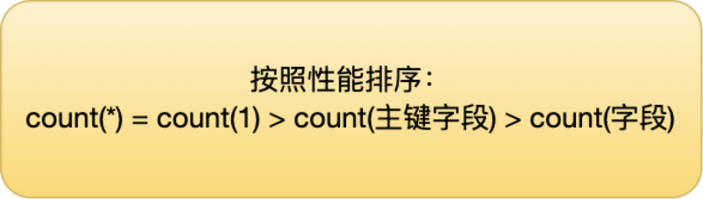

# 索引

B-Tree 索引：B-Tree（或称为平衡树）索引是最常见和默认的索引类型。它适用于各种查询条件，可以快速定位到符合条件的数据。B-Tree 索引适用于普通的查找操作，支持等值查询、范围查询和排序。

## MySQL 存储引擎 InnoDB

-   InnoDB 支持行级别的锁粒度，MyISAM 不支持，只支持表级别的锁粒度。

-   MyISAM 不提供事务支持。InnoDB 提供事务支持，实现了 SQL 标准定义了四个隔离级别。

-   MyISAM 不支持外键，而 InnoDB 支持。

-   MyISAM 不支持 MVCC，而 InnoDB 支持。

-   虽然 MyISAM 引擎和 InnoDB 引擎都是使用 B+Tree 作为索引结构，但是两者的实现方式不太一样。

-   MyISAM 不支持数据库异常崩溃后的安全恢复，而 InnoDB 支持。

-   InnoDB 的性能比 MyISAM 更强大。

## MySQL 索引

#### 用hash？

Hash 索引不支持顺序和范围查询。

#### 用红黑树？

红黑树并不追求严格的平衡，而是大致的平衡。正因如此，红黑树的查询效率稍有下降，因为红黑树的平衡性相对较弱，可能会导致树的高度较高，这可能会导致一些数据需要进行多次磁盘 IO 操作才能查询到，这也是 MySQL 没有选择红黑树的主要原因。

**对于数据在内存中的这种情况来说，红黑树的表现是非常优异的。**

### B 树 & B+树

B 树也称 B-树,全称为 **多路平衡查找树** ，B+ 树是 B 树的一种变体。B 树和 B+树中的 B 是 `Balanced` （平衡）的意思。

B+ 树与 B 树差异的点，主要是以下这几点：

-   叶子节点（最底部的节点）才会存放实际数据（索引+记录），非叶子节点只会存放索引；
-   所有索引都会在叶子节点出现，叶子节点之间构成一个有序链表；
-   非叶子节点的索引也会同时存在在子节点中，并且是在子节点中所有索引的最大（或最小）。
-   非叶子节点中有多少个子节点，就有多少个索引；

**B+ 树的插入和删除效率更高**。但是查询可能略逊B树一筹。

**B+ 树所有叶子节点间还有一个链表进行连接，这种设计对范围查找非常有帮助**

>   B树 B+树
>
>   https://fhfirehuo.github.io/Attacking-Java-Rookie/Chapter02/BTree.html
>
>   https://www.xiaolincoding.com/mysql/index/why_index_chose_bpuls_tree.html#%E4%BB%80%E4%B9%88%E6%98%AF-b-%E6%A0%91
>
>   B+树如何应用在InnoDB中
>
>   https://www.xiaolincoding.com/mysql/index/page.html#innodb-%E6%98%AF%E5%A6%82%E4%BD%95%E5%AD%98%E5%82%A8%E6%95%B0%E6%8D%AE%E7%9A%84

**InnoDB 的数据是按「数据页」为单位来读写的**，也就是说，当需要读一条记录的时候，并不是将这个记录本身从磁盘读出来，而是以页为单位，将其整体读入内存。

数据库的 I/O 操作的最小单位是页，**InnoDB 数据页的默认大小是 16KB**，意味着数据库每次读写都是以 16KB 为单位的，一次最少从磁盘中读取 16K 的内容到内存中，一次最少把内存中的 16K 内容刷新到磁盘中。


在 File Header 中有两个指针，分别指向上一个数据页和下一个数据页，连接起来的页相当于一个双向的链表

当我们需要存储大量的记录时，就需要多个数据页，这时我们就需要考虑如何建立合适的索引，才能方便定位记录所在的页。

为了解决这个问题，**InnoDB 采用了 B+ 树作为索引**。磁盘的 I/O 操作次数对索引的使用效率至关重要，因此在构造索引的时候，我们更倾向于采用**<u>“矮胖”的 B+ 树数据结构</u>**，这样所需要进行的**<u>磁盘 I/O 次数更少</u>**，而且 B+ 树 更适合进行关键字的范围查询。

>   原因就是只有叶子结点是存真正数据的，上层节点都是用来存放目录的 作为索引


### 聚簇索引和二级索引

索引又可以分成聚簇索引和非聚簇索引（二级索引），它们区别就在于叶子节点存放的是什么数据：

-   聚簇索引的叶子节点存放的是实际数据，所有完整的用户记录都存放在聚簇索引的叶子节点；
-   二级索引的叶子节点存放的是主键值，而不是实际数据。

因为表的数据都是存放在聚簇索引的叶子节点里，所以 InnoDB 存储引擎**一定会为表创建一个聚簇索引，且由于数据在物理上只会保存一份，所以聚簇索引只能有一个。**

InnoDB 在创建聚簇索引时，会根据不同的场景选择不同的列作为索引：

-   如果有主键，默认会使用主键作为聚簇索引的索引键；
-   如果没有主键，就选择第一个不包含 NULL 值的唯一列作为聚簇索引的索引键；
-   在上面两个都没有的情况下，InnoDB 将自动生成一个隐式自增 id 列作为聚簇索引的索引键；

一张表只能有一个聚簇索引，那为了实现非主键字段的快速搜索，就引出了二级索引（非聚簇索引/辅助索引），它也是利用了 B+ 树的数据结构，但是二级索引的叶子节点存放的是主键值，不是实际数据。

**如果某个查询语句使用了二级索引，但是查询的数据不是主键值，这时在二级索引找到主键值后，需要去聚簇索引中获得数据行，这个过程就叫作「回表」，也就是说要查两个 B+ 树才能查到数据。不过，当查询的数据是主键值时，因为只在二级索引就能查询到，不用再去聚簇索引查，这个过程就叫作「索引覆盖」，也就是只需要查一个 B+ 树就能找到数据。**

## 索引失效

索引并不是万能的。建立了索引，并不意味着任何查询语句都能走索引扫描。

### 对索引使用左或者左右模糊匹配

**因为索引 B+ 树是按照「索引值」有序排列存储的，只能根据前缀进行比较。**


### 对索引使用函数

因为索引保存的是索引字段的原始值，而不是经过函数计算后的值，自然就没办法走索引了。

### 对索引进行表达式计算

不是说不能用表达式！

```sql
select * from t_user where id + 1 = 10;
```

这样就走不了，但是如果改成 id = 10 -1 就可以走索引了

### 对索引隐式类型转换

比如：

```sql
select * from t_user where phone = 1300000001;
```

用整型作为输入参数，但是实际上 phone 是一个 varchar 字段。

**但是，**反过来就还是可以走索引的！！

首先我们要知道 MySQL 的数据类型转换规则是什么？就是看 MySQL 是会将字符串转成数字处理，还是将数字转换成字符串处理？

**MySQL 在遇到字符串和数字比较的时候，会自动把字符串转为数字，然后再进行比较**。

```sql
select * from t_user where CAST(phone AS signed int) = 1300000001;
```

**对索引使用函数是会导致索引失效的**。

### 联合索引非最左匹配

从 MySQL 5.6 之后，有一个**索引下推功能**，可以在存储引擎层进行索引遍历过程中，对索引中包含的字段先做判断，直接过滤掉不满足条件的记录，再返还给 Server 层，从而减少回表次数。

**最左前缀匹配原则**

最左前缀匹配原则指的是，在使用联合索引时，**MySQL** 会根据联合索引中的字段顺序，从左到右依次到查询条件中去匹配，如果查询条件中存在与联合索引中最左侧字段相匹配的字段，则就会使用该字段过滤一批数据，直至联合索引中全部字段匹配完成，或者在执行过程中遇到范围查询（如 **`>`**、**`<`** ）才会停止匹配。对于 **`>=`**、**`<=`**、**`BETWEEN`**、**`like`** 前缀匹配的范围查询，并不会停止匹配。所以，我们在使用联合索引时，可以将**区分度高的字段放在最左边，这也可以过滤更多数据**。

### WHERE 子句中的 OR

在 WHERE 子句中，如果在 OR 前的条件列是索引列，而在 OR 后的条件列不是索引列，那么索引会失效。

因为 OR 的含义就是两个只要满足一个即可，因此只有一个条件列是索引列是没有意义的，只要有条件列不是索引列，就会进行全表扫描。

## COUNT()



>   count(1) 实际上 就是 count(*)  **count(\*) 执行过程跟 count(1) 执行过程基本一样的**

count(1)、 count(*)、 count(主键字段)在执行的时候，如果表里存在二级索引，优化器就会选择二级索引进行扫描。

所以，如果要执行 count(1)、 count(*)、 count(主键字段) 时，尽量在数据表上建立二级索引，这样优化器会自动采用 key_len 最小的二级索引进行扫描，相比于扫描主键索引效率会高一些。

再来，就是不要使用 count(字段) 来统计记录个数，因为它的效率是最差的，会采用全表扫描的方式来统计。如果你非要统计表中该字段不为 NULL 的记录个数，建议给这个字段建立一个二级索引。


