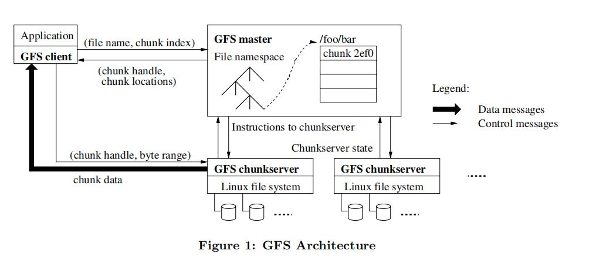
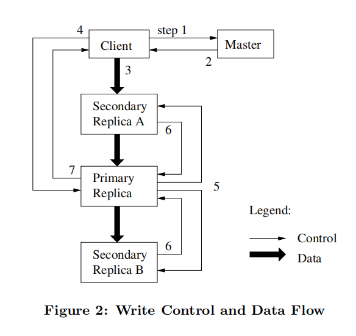

# GFS

------

## As a 大型分布式文件系统

### WHY HARD？

设计难点循环：performance -> sharding -> fault -> tolrance -> relication -> inconsistency -> consistency -> performance

> 分布式存储系统的难点在于：最开始时把文件存储在多个服务器上做到并行读取，提高吞吐量，但是众多服务器总是会出现个别服务器出错的情况，一个解决方法是对同一个文件存储多个副本，同时这又带来了一致性的问题，不得不使用各种协议来保证同一个文件的多个副本总是保持一致的，但这又会降低性能，所以，找到性能和一致性的平衡点是一件具有挑战性的事情。
<!--more-->
## GFS一致性

- 多个副本不保证一致，客户端可以从任意一个副本读，会读到不一致的数据

这是可容忍的，因为“没人在意网站投票数据的实时性，和2000条检索数据中缺了一条”

## GFS设计目标

- 大容量、快速的文件系统
- 全局的，应用共享
- 文件分割-shard
- 自动恢复-auto recovery
- 单数据中心-master
- 内部使用，不对外开放
- 大型文件顺序读写，关注吞吐量

## GFS架构

>一个 GFS 集群通常由一个 master 和多个 chunkserver 组成，可以被多个客户端访问。

## GFS读过程

1. 客户端发送文件名和偏移量到master
2. master返回对应的chunk Handle和服务器列表
3. 客户端选择一个网络上最近的服务器读取数据，可能会读到旧数据

## GFS写过程

1. 客户端请求master节点
2. master确定primary
   1. 找到持有最新版本的副本
   2. 挑选一个作为primary, 其余作为secondary
   3. 增加版本号
   4. 告知副本节点版本号，并通过租约机制告知primary租约期内会是primary节点，避免租约内有两个primary
   5. 持久化版本号
   6. 返回所有副本节点给客户端

3. 客户端将数据写入到所有副本的临时位置，得到响应通知primary
4. primary顺序执行文件追加，并通知secondary可以追加到文件中，如果全部成功返回给客户端成功，否则返回失败。

Figure 2 展示了 GFS 中**写操作**的流程：

1. client 向 master 询问哪个 chunkserver 持有块的租约和副本的位置，如果没有 chunkserver 持有租约，master 会首先增加块版本号，随机选择一个赋予租约成为 primary，通知 primary 和 seconda 块版本号变更。
2. master 返回 primary 和 secondary 的位置信息以及最新的块版本号，client 缓存这份信息，后续只有当 primary 不可达或 primary 声称不再持有租约时，client 才需要和 master 沟通。
3. client 把数据推送到副本，推送的顺序是不定的，不必先从 primary 开始，**副本收到数据后先保存在缓存中**。
4. 一旦所有副本都确认收到了数据，client 就会向 primary 发出一个写请求，这个请求标识了之前推送的数据。primary 收到请求后检查块版本号是否匹配以及自己的块租约是否有效，若存在条件不满足则拒绝写请求。由于 primary 可能收到了多个 client 的请求，因此 primary 为每个请求分配一个序列号，然后按照序列号的顺序更新自己的本地状态。
5. primary 转发写请求和相同的序列号到所有的 secondary，secondary 也按照序列号顺序更新状态。
6. secondary 回复表明自己完成了操作。
7. primary 回复 client，并表明过程中发生的任何错误。当发生错误时，文件变更已在 primary 和 seconda ry 的一个子集上执行完毕，这造成了副本间的不一致状态，这个问题会交给 client 处理，一般是重试几次操作(3)到操作(7) 。

Figure 2 也表明了，控制流是**从 client 到 primary 再到 secondary** ，而数据流是**以流水线的方式在某个 chunkserver 链上线性推送**。